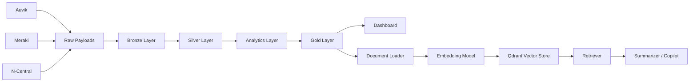

# Incident Intelligence Copilot

End-to-end Incident Intelligence Platform for ingesting noisy infrastructure alerts, building correlated incident intelligence, and enabling faster investigations through a GenAI Copilot and dashboard.

---

## Project Overview

Modern IT operations receive thousands of alerts from network and infrastructure monitoring tools. Many alerts are repetitive, duplicated, or low signal. This project standardizes and correlates those alerts into meaningful incidents, generates analytics-ready Gold datasets, and powers a Retrieval-Augmented Generation (RAG) Copilot for operational Q&A.

Primary goals:

- Reduce alert fatigue
- Improve signal-to-noise ratio
- Accelerate root-cause analysis
- Provide actionable investigation context for engineers

---

## Problem Statement

SRE/Operations teams struggle with:

- Multiple monitoring sources with inconsistent schemas
- Duplicate and contradictory alerts
- Weak incident-level context across systems
- Slow triage and delayed remediation

---

## Solution Summary

This repository implements a medallion-style data and intelligence pipeline:

**Raw Alerts → Bronze → Silver → Analytics Layer → Gold → RAG Copilot + Dashboard**

Data sources currently modeled:

- Auvik (network monitoring)
- Meraki (network devices/connectivity)
- N-Central (server/infrastructure health)

---

## System Architecture



---

## Data Pipeline Layers

### Bronze Layer

- Initial ingestion and raw staging
- SQL + notebook-based ingestion in `etl/bronze/`

### Silver Layer

- Cleaning, schema harmonization, preprocessing
- Notebook + SQL transformations in `etl/silver/`

### Analytics Layer

- Incident correlation (5-minute windows)
- Feature engineering (alert/device/incident)
- Incident clustering (DBSCAN)
- Device anomaly detection (IsolationForest)
- Reliability scoring and failure pattern analytics

### Gold Layer

Generated artifacts in `analytics/outputs/`:

- `incidents.parquet`
- `device_metrics.parquet`
- `alert_stats.parquet`
- `incident_timeline.parquet`
- `incident_summary.json`

---

## GenAI Copilot (RAG)

The Copilot pipeline in `llm/` performs:

1. Load incident documents from Gold summary
2. Convert documents into embeddings (`llm/rag/embedding_model.py`)
3. Store/search vectors in Qdrant (`llm/rag/vector_store.py`)
4. Retrieve top-k relevant context (`llm/rag/retriever.py`)
5. Generate grounded answer (`llm/summarizer.py`)

Example questions:

- "What caused the VPN outage?"
- "Which organization generated the most alerts?"
- "What devices were affected?"
- "What is the likely root cause and recommended action?"

---

## Dashboard

`dashboard/app.py` provides:

- Alert severity distribution
- Alerts-over-time trends
- Top noisy devices
- Incident monitoring table
- Root-cause exploration workflow

---

## Repository Structure (Current)

```text
Team15-KenexaiHackathon/
├── analytics/
│   ├── analytics_inner/
│   │   ├── failure_patterns.py
│   │   ├── incident_statistics.py
│   │   └── reliability_scores.py
│   ├── feature_engineering/
│   │   ├── alert_features.py
│   │   ├── device_features.py
│   │   └── incident_features.py
│   ├── gold_builder/
│   │   ├── build_alert_stats.py
│   │   ├── build_device_metrics.py
│   │   ├── build_incidents_table.py
│   │   └── build_timeline.py
│   ├── incident_engine/
│   │   ├── incident_builder.py
│   │   ├── incident_clustering.py
│   │   └── incident_rules.py
│   ├── ml_models/
│   │   ├── anomaly_detection.py
│   │   └── clustering_model.py
│   ├── reports/
│   │   ├── evaluation_metrics.py
│   │   └── incident_reports.py
│   ├── outputs/
│   │   ├── alert_stats.parquet
│   │   ├── device_metrics.parquet
│   │   ├── incidents.parquet
│   │   ├── incident_summary.json
│   │   └── incident_timeline.parquet
│   └── run_analytics.py
├── data/
│   ├── raw/
│   │   ├── Auvik Payload.json
│   │   ├── Meraki Payload.json
│   │   ├── N-Central Payload.xml
│   │   └── test_incidents.json
│   ├── synthetic/
│   │   ├── auvik_synthetic.json
│   │   ├── meraki_synthetic.json
│   │   └── ncentral_synthetic.xml
│   ├── processed/
│   │   └── alerts_clean.csv
│   └── parquet_exports/
│       ├── alerts_clean.parquet
│       ├── device_alert_summary.parquet
│       ├── dim_alert_types.parquet
│       ├── dim_devices.parquet
│       ├── dim_severity.parquet
│       ├── dim_time.parquet
│       ├── fact_alerts.parquet
│       ├── fact_alerts_enriched.parquet
│       └── incidents.parquet
├── etl/
│   ├── bronze/
│   │   ├── bronze.sql
│   │   └── ingestation.ipynb
│   ├── silver/
│   │   ├── silver.sql
│   │   ├── ingestation.ipynb
│   │   └── preprocessing.ipynb
│   ├── gold/
│   │   ├── gold.sql
│   │   └── ingestation.ipynb
│   ├── generator/
│   │   └── generator.ipynb
│   └── simulator/
│       └── stream_alerts.ipynb
├── llm/
│   ├── agents/
│   │   ├── agent_executor.py
│   │   ├── incident_agent.py
│   │   └── tools.py
│   ├── prompt_templates/
│   │   └── incident_prompt.txt
│   ├── rag/
│   │   ├── document_loader.py
│   │   ├── embedding_model.py
│   │   ├── retriever.py
│   │   └── vector_store.py
│   ├── copilot_api.py
│   └── summarizer.py
├── dashboard/
│   └── app.py
├── requirements.txt
└── README.md
```

---

## Setup & Run

### 1) Environment Setup

```bash
python -m venv .venv
```

PowerShell:

```bash
.\.venv\Scripts\Activate.ps1
pip install -r requirements.txt
```

For dashboard/RAG dependencies (if not already in `requirements.txt`):

```bash
pip install streamlit plotly psycopg2-binary qdrant-client sentence-transformers groq python-dotenv
```

---

### 2) Run Analytics Pipeline

CSV/parquet exports test mode:

```bash
python -m analytics.run_analytics --silver-path data/parquet_exports --output-dir analytics/outputs
```

or

```bash
python -m analytics.run_analytics --silver-path data/processed/alerts_clean.csv --output-dir analytics/outputs
```

---

### 3) Run Qdrant (for RAG)

Use your Docker Qdrant setup and point runtime env vars:

```bash
# PowerShell
$env:QDRANT_HOST="localhost"
$env:QDRANT_PORT="6333"
```

---

### 4) Run Copilot Query

```bash
python -m llm.summarizer "Give me the total alerts caused by organization Wyffels."
```

---

### 5) Run Dashboard

```bash
python -m streamlit run dashboard/app.py
```

---

## How One Alert Becomes an Insight

1. Alert is ingested from Auvik/Meraki/N-Central
2. Bronze stores raw payload with minimal changes
3. Silver normalizes schema and cleans records
4. Analytics correlates alert into an incident cluster
5. Gold tables update incident/device/timeline metrics
6. Summary JSON is indexed for RAG
7. Copilot retrieves relevant context and returns investigation guidance

---

## Future Improvements

- Real-time streaming ingestion (Kafka/EventHub)
- Stronger deduplication and temporal matching rules
- Enhanced root-cause ranking with graph-based correlation
- Tenant-aware access control and audit trails
- Continuous evaluation metrics persisted to Gold

---

## Team

Team 15 — KenexAI Hackathon

---

## Acknowledgements

- KenexAI Hackathon organizers and mentors
- Open-source ecosystem: Pandas, scikit-learn, Streamlit, Qdrant, sentence-transformers, Groq
